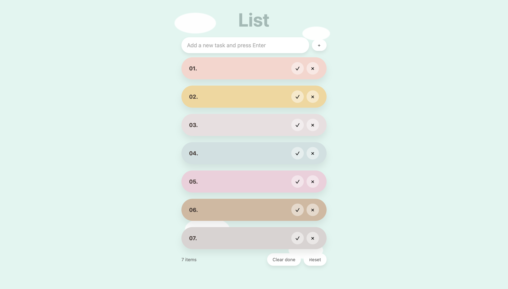
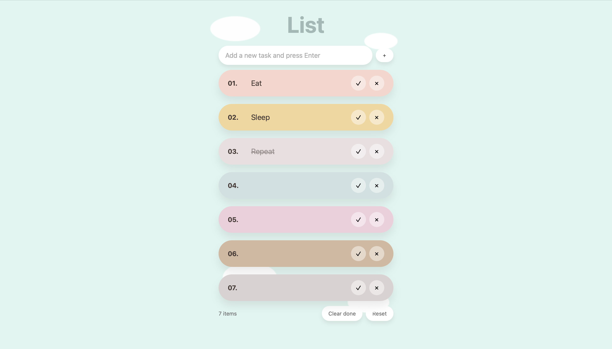

# to-do-list-using-javascript-easy
A visually appealing pastel-themed To-Do List mini project built with HTML, CSS, and JavaScript. It features drag-and-drop reordering, persistent storage via localStorage, inline editing, and a clean, cloud-inspired UI. Perfect for practicing DOM manipulation, event handling, and local data persistence in a fun and aesthetic way.

# 🌤️ Pastel To-Do List — Mini Project

A clean, pastel-themed **to-do list** built with **HTML, CSS, and JavaScript**.  
Inspired by soft cloud aesthetics, this app helps you stay organized with a touch of minimal beauty.


#PREVIEW



---

## ✨ Features
- 🖊 **Add, edit, and delete** tasks easily.
- ✔ **Mark tasks as done** with a single click.
- ↕ **Drag & drop reordering** for custom task arrangement.
- 💾 **Persistent storage** via `localStorage` — tasks stay after page refresh.
- 🎨 **Pastel cloud-inspired design** with 8 colored task slots.
- ♿ Accessible markup with ARIA labels.

---

## 🚀 Getting Started

### 1. Clone the repository
```bash
git clone https://github.com/SaniaDebbarma/to-do-list-using-javascript-easy/tree/main
cd pastel-todo-mini

2. Open in your browser

Just open the index.html file in your favorite browser.

 Project Structure
📁 pastel-todo-mini/
├── index.html   # Main HTML file with embedded CSS & JS
├── screenshot.png # Optional preview image for GitHub
└── README.md    # This file
🛠 How It Works
	•	All tasks are stored in your browser’s localStorage under the key todo-mini-v1.
	•	You can drag a task to reorder it.
	•	Inline editing lets you modify text directly without dialogs.
	•	“Clear done” removes completed tasks, “Reset” restores 8 empty slots.
📜 License

This project is licensed under the MIT License — feel free to use, modify, and share.
